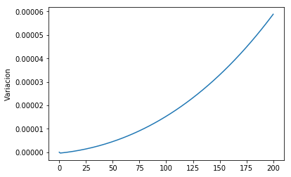
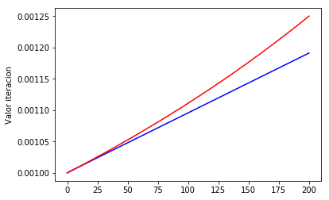

# MCOC-Proyecto-0
# Introducción
Este proyecto tiene como objetivo ilustrar el concepto de la perdida de significancia en las operaciones aritméticas, la cual tiene su origen en la aproximación que hace el sistema dependiendo de la cantidad de información que quiera almacenar el usuario.
# Este ejemplo
Para este ejemplo tome una función cubica f(x)=x^3+x^2+x , la cual tiene como valor inicial x= 0.001, iterando estos valores de forma f(x)=f(x_(-1)) logrando 200 ciclos y guardando la información.
Esta operación se realizó para números de tamaño float16 y float64.
# Resultados
Luego de tener los datos necesarios hacemos la comparación como:
```
Variacion = Z[i] – Y[i]
```
Donde Z[i] es la lista de los números de largo Float64 y Y[i] los de Float16


Ilustración 1

Valores Float16
Valores Float64

Ilustración 2
 
Diferencia o Variación
Esta diferencia en los valores de las dos listas de datos se debe a que el formato de datos float16 trunca los números a la 〖10〗^(-7), mientras que float64 lo hace a 〖10〗^(-14) lo cual en otras palabras quiere decir que almacena el doble de información. Esto habla de las cifras significantes.
La diferencia entre estos números se va a ver a la millonésima parte, lo cual al ser sujeto a la iteración aumenta. 
Es necesario tener en consideración este concepto ya que como se puede ver en la ilustración 2 la diferencia aumenta mientras mayor sea el numero de la iteración.
# Output de la consola:
```
valor float16: 0.001 Valor float64: 0.001 Diferencia: 0.0
valor float16: 0.0010242 Valor float64: 0.00102564099872 Diferencia: 1.39478290249e-06
valor float16: 0.0010481 Valor float64: 0.00105263152075 Diferencia: 4.54344701895e-06
valor float16: 0.0010719 Valor float64: 0.00108108098652 Diferencia: 9.15105487507e-06
valor float16: 0.0010958 Valor float64: 0.00111111097423 Diferencia: 1.53391846754e-05
valor float16: 0.0011196 Valor float64: 0.00114285695667 Diferencia: 2.32433092067e-05
valor float16: 0.0011435 Valor float64: 0.00117647034452 Diferencia: 3.30148391454e-05
valor float16: 0.0011673 Valor float64: 0.00121212090115 Diferencia: 4.48235378723e-05.
```
